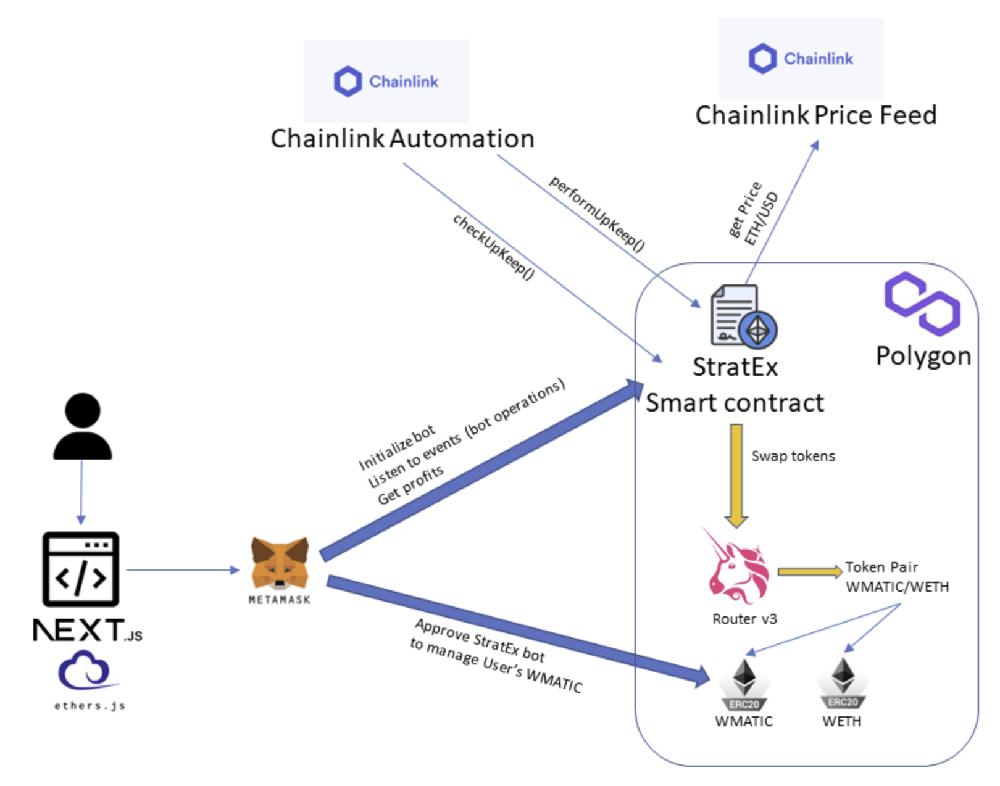

  

# Stratex
Automated Decentralized Bot for trading at different limits and ranges, depending on customer requirements.

## User Benefits
- Users can delegate a fixed amount of tokens to the bot and wait for it to automatically buy/sell, looking for profits on Uniswap.
- Users can define a range to operate within and set grids for purchase/sell, along with the percentage for each transaction.

## Inspiration
We found that this kind of bot is only available on centralized exchanges like Binance, but it should also be available for decentralized ones like Uniswap. So, based on Uniswap docs, we implemented this automated bot.

## What it does
Our bot takes user input for the amount to spend, the upper and lower ranges to operate within, and the specific points between those limits to either purchase or sell the base token against a stablecoin.

## How we built it
- Chainlink services and Uniswap are the primary implementations of this hackathon. Chainlink Automation is used to determine when a buy or sell (swap) operation should be triggered based on a calculation using the price of the base token pair against the dollar, provided by Chainlink Price Feed.
- We built a "bot" smart contract to operate in a decentralized manner, connected to the checkUpkeep and performUpkeep Chainlink automation functions. [Contract Source Code](https://github.com/nicolasepiscopo/stratex/blob/main/backend/contracts/TradeBot.sol)

## Challenges we ran into
- Implementing the idea into a functional smart contract that operates autonomously.
- Creating the frontend interface to display events and facilitate bot creation and interaction.

## Accomplishments that we're proud of
This is the first hackathon for many of us, and we managed the teamwork very well, despite being located in three different continents:

- [Jeevan Siddu](https://github.com/jeevansiddu) from India.
- [Nicolás Epíscopo](https://github.com/nicolasepiscopo) from Argentina.
- [Pablo Cosío](https://github.com/pcosio) from Spain.
- [Sebastian Guaqueta](https://github.com/sheva323) from Colombia.
- [Siva Rama](https://github.com/sivaramaaa) from India.

## What we learned
- How to use Chainlink automation to fetch and run functions in smart contracts in a dynamic and functional way.
- Integrating Uniswap functionality into the smart contract to provide swapping functionality to the platform.
- Managing ERC20 token movements and management through automated functions.

## What's next for StratEx
- Optimizing the process in terms of gas consumption.
- Providing a highly scalable solution. To achieve this, we are working on enhancements to support multiple bots for multiple users and extend the service with more supported token pairs.

