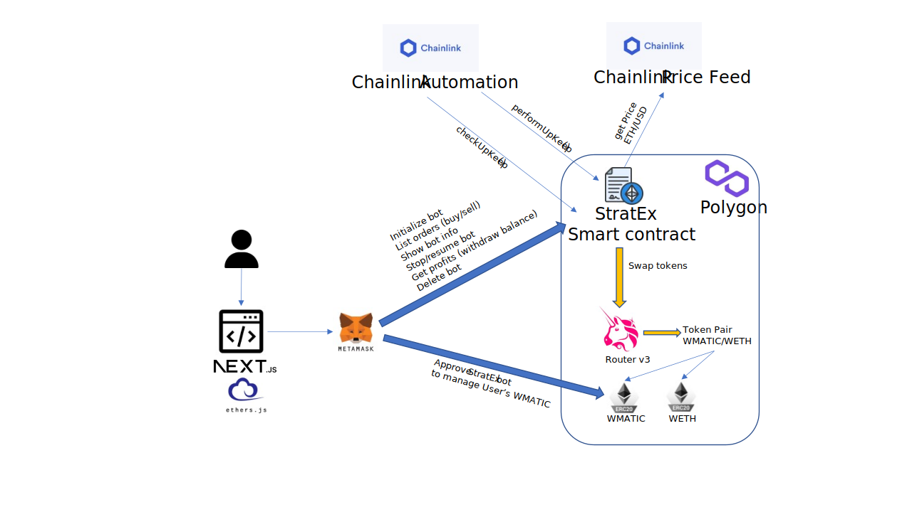

  

# Stratex
Automated decentralized bot that leverages Chainlink services and Uniswap to execute optimized buy and sell operations, enabling users to trade efficiently and seek profits within specified ranges.

## User Benefits
- Users have the option to delegate a fixed amount of tokens to the bot and rely on its automated functionality to execute buy and sell orders on Uniswap, aiming to generate profits.
- Users have the flexibility to define a specific range within which the bot operates and set grids for purchase and sell actions. Additionally, they can specify the desired percentage for each transaction.

## Inspiration
During our research, we discovered that this type of bot was predominantly available on centralized exchanges such as Binance. However, we recognized the importance of making it accessible on decentralized exchanges like Uniswap as well. With reference to the Uniswap documentation, we proceeded to implement this automated bot.

## What it does
Our bot incorporates user input for various parameters, including the spending amount, upper and lower ranges for operations, as well as specific points within those limits to execute purchases or sales of the base token against a stablecoin.

## Demo
We dedicated significant effort to develop the initial prototype, which is the Single Bot that you can see in the video.

### New Features
Once we successfully achieved the first version, we proceeded to the next step, which involved building a prototype capable of supporting multiple users and multiple bots. As a result, we were able to complete this alpha implementation, and you can find it here:

- Try it out: https://main--wonderful-stroopwafel-b179a1.netlify.app/
- Bot address: https://mumbai.polygonscan.com/address/0xc1068508bae3721016745db9000240f60bf59ab0
- github: https://github.com/nicolasepiscopo/stratex
- Chainlink UpKeep: https://automation.chain.link/mumbai/49731425686354808993613655674146670068471707538328680082346472121761589595239

We are aware that there are numerous improvements planned for our project following this hackathon, and we have mentioned some of them in our future plans section [later](#what's-next-for-stratex).

Regarding the first screen that allows users to create a bot, it remains the same as the single bot implementation showcased in the video. However, we repeated the workflow to obtain a comprehensive overview of the complete functionality:
#### Connect user wallet
> ⚠️ We only support Metamask just now

#### Create Bot
When you click on `Create your First Bot` button in the home screen the create bot form will appear if there is no previous bot instances created in the smart contract.

##### Select Target Token and Amount to Invest

##### Configure Bot Parameters

#### Dashboard
Afterward, the subsequent script displays all the user's currently running bots. This screen allows the user to effectively manage all of their active bots.

#### Bot Details Page
Next, the user has the option to expand the details by clicking on an icon resembling a settings icon. Here, the user can access comprehensive information regarding the bot, including the amount of WMATIC and WETH being managed, grids, last execution details, and the current profit generated by the bot. Within this dashboard, the user has the ability to make modifications to the bot, such as pausing the execution, withdrawing profits (only enabled when the WETH balance is 0), pausing or resuming the bot's execution, deleting the bot, and depositing (delegate & transfer) additional WMATIC to the bot.

***Real Time Token Price***

Additionally, there is a chart where the user can monitor the real-time ETH price in relation to USD. This chart provides the user with a visual representation of the fluctuating ETH price in USD.

## How we built it
- Chainlink services and Uniswap are the primary implementations of this hackathon. Chainlink Automation is used to determine when a buy or sell (swap) operation should be triggered based on a calculation using the price of the base token pair against the dollar, provided by Chainlink Price Feed.
- We built a "bot" smart contract to operate in a decentralized manner, connected to the checkUpkeep and performUpkeep Chainlink automation functions. [Contract Source Code](https://github.com/nicolasepiscopo/stratex/blob/main/backend/contracts/StratEx.sol)

## Challenges we ran into
- Implementing the idea into a functional smart contract that operates autonomously.
- Creating the frontend interface to display events and facilitate bot creation and interaction.

## Accomplishments that we're proud of
This is the first hackathon experience for many of us, and despite being located in three different continents, we effectively managed our teamwork.

- [Jeevan Siddu](https://github.com/jeevansiddu) from India.
- [Nicolás Epíscopo](https://github.com/nicolasepiscopo) from Argentina.
- [Pablo Cosío](https://github.com/pcosio) from Spain.
- [Sebastian Guaqueta](https://github.com/sheva323) from Colombia.
- [Siva Rama](https://github.com/sivaramaaa) from India.

## What we learned
- How to use Chainlink automation to fetch and run functions in smart contracts in a dynamic and functional way.
- Integrating Uniswap functionality into the smart contract to provide swapping functionality to the platform.
- Managing ERC20 token movements and management through automated functions.

## What's next for StratEx
To deliver a production-ready version of our product, we have outlined several enhancements:

### Support for more token pairs
Currently, we only support WMATIC and WETH, the only ones supported under mumbai testnet. Our plan is to expand the token pair options, allowing users to trade and manage a wider range of tokens.

### Automated management of Chainlink UpKeepers' Link balance
We are developing plans to implement automatic management of the Link balance for Chainlink UpKeepers. This feature will streamline the process and ensure the efficient utilization of Link tokens.

### Improved logic in smart contracts
We aim to optimize the logic implemented in our smart contracts to reduce gas consumption. By doing so, users will be able to maximize their profits while maintaining cost-effectiveness.

### Robust security measures
We prioritize the security aspects of our implementation. We will implement stringent security protocols to safeguard user funds and ensure a secure environment for our users.

### Migration to a highly scalable solution
Our future plans involve migrating to a high-scalable solution. We intend to implement a proxy-based architecture using the contract factory pattern. This approach will allow us to deploy and limit the number of bots (grouped as batches) in each deployed contract. The proxy will act as a frontend for our dApp and other parties interacting with our core implementation.

### Enhanced data analytics and statistics
We are focused on improving data analytics and statistics for better user experience. This entails leveraging protocols like The Graph to index events and efficiently manage the data provided by our smart contracts. Additionally, we are exploring platforms such as Dune Analytics and other DeFi data providers to empower users in making informed decisions about their bots.

These enhancements aim to deliver a more comprehensive and efficient product, providing users with an enhanced trading experience and valuable insights for decision-making.

## Resources

- [Front-end App README](frontend/README.md)
- [Back-end App README](backend/README.md)

