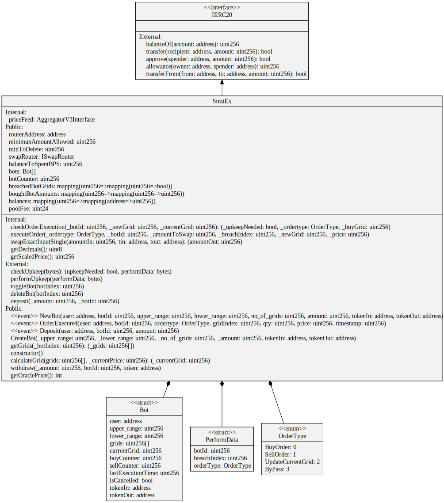

# StratEx smart contract

Execute the following command to deploy the smart contract on Mumbai testnet

```shell
npx hardhat run scripts/01-deploy.js --network mumbai
```

The contract will be automatically verified on polygonscan
There are any parameter in the constructor so after deploying it, it will be ready to be used by our frontend. The address needs to be setup in the environment file of the frontend project before building and running it.

Here we have the schema corresponding to our contract


